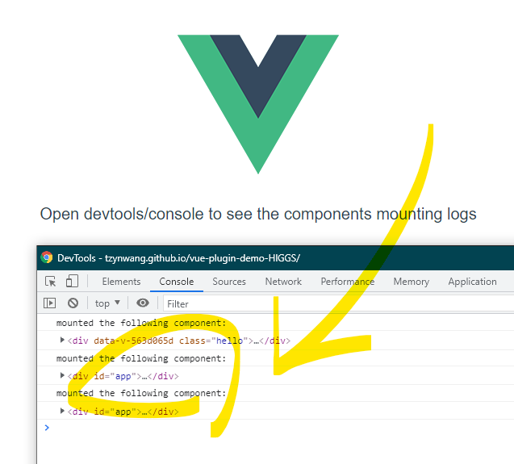

# Vue plugin DEMO
URL: https://tzynwang.github.io/vue-plugin-demo-HIGGS/

## Description
- Customized plugin source codes are in the file: `src/utils/plugin.js`
- Open the browser and its devtool (e.g. press F12 for launching Chrome's devtool), switch to the console tab to view the components mounting logs

